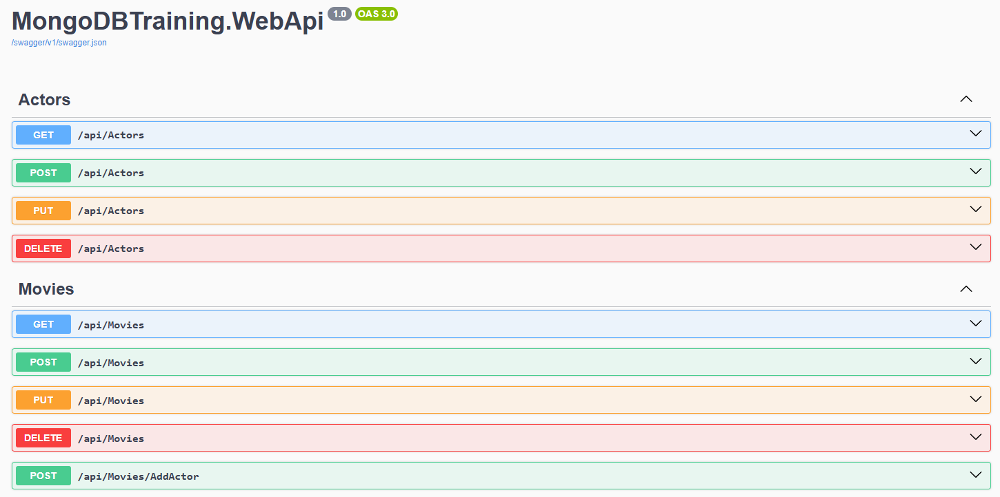
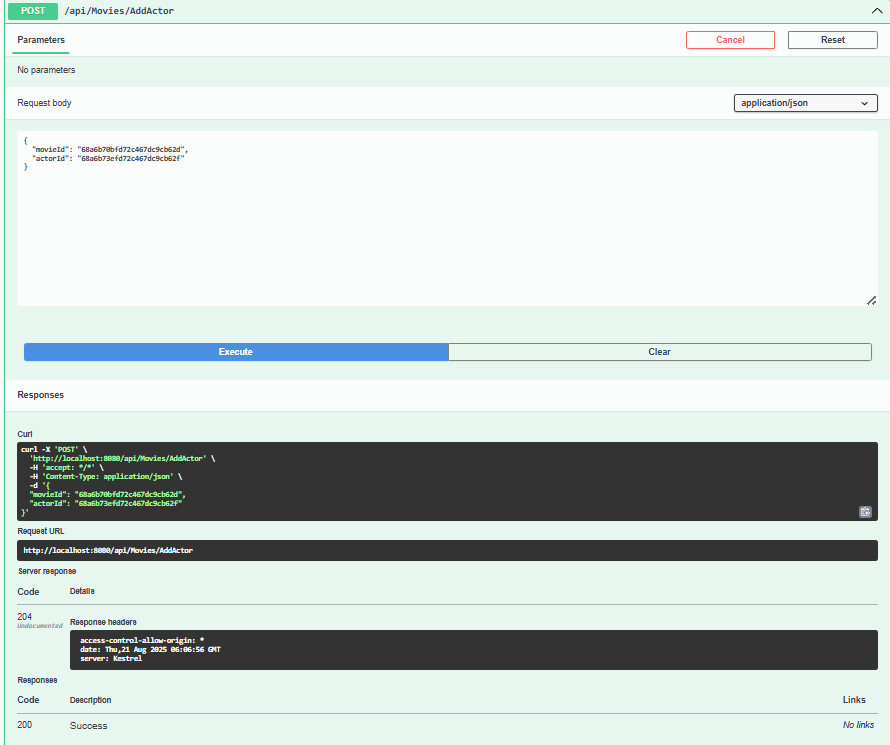
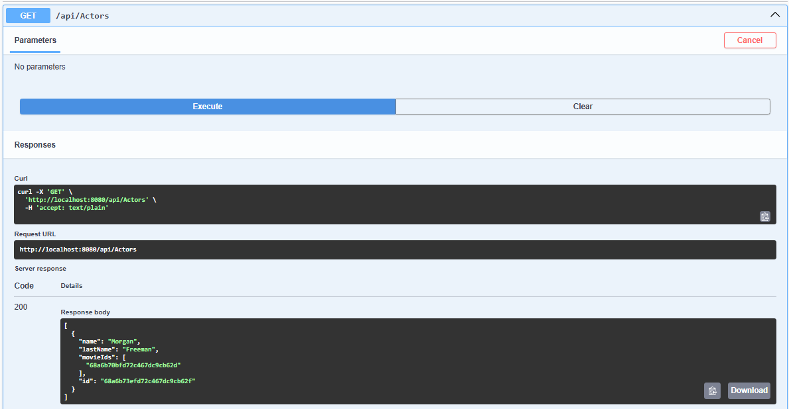

# MongoDBTraining

Учебный проект на **ASP.NET Core + MongoDB**, демонстрирующий:
- работу с **MongoDB** в режиме **Replica Set**,
- использование **транзакций** при обновлении связанных коллекций (фильмы ↔ актёры),
- применение **паттерна репозиторий**,
- конфигурацию подключения к MongoDB через **Options pattern**,
- контейнеризацию с помощью **Docker Compose**.

---

## 📑 Оглавление
- [Структура контейнеров](#структура-контейнеров)
  - [mongodbtraining.webapi](#1-mongodbtrainingwebapi)
  - [mongo1](#2-mongo1)
  - [setup-replica](#3-setup-replica)
- [Volumes](#volumes)
- [Networks](#networks)
- [Запуск проекта](#запуск-проекта)
- [Скриншоты эндпоинтов в Swagger](#скриншоты-эндпоинтов-в-swagger)
  - [Все эндпоинты](#все-эндпоинты)
  - [Добавление актёра в фильм](#добавление-актёра-в-фильм)
  - [Просмотр актёров](#просмотр-актёров)
  - [Просмотр фильмов](#просмотр-фильмов)
- [Работа с MongoDB](#работа-с-mongodb)
- [Репозиторий данных (BaseRepository)](#репозиторий-данных-baserepository)
  - [Класс `BaseRepository<T>`](#класс-baserepositoryt)
  - [Особенности](#особенности)
  - [Репозитории фильмов и актёров](#репозитории-фильмов-и-актёров)
    - [MovieRepository](#movierepository)
    - [ActorRepository](#actorrepository)
  - [Транзакции](#транзакции)
- [Конфигурация и валидация настроек MongoDB](#конфигурация-и-валидация-настроек-mongodb-с-использованием-options-pattern-в-aspnet-core)
  - [Класс с настройками](#класс-с-настройками)
  - [Валидация настроек](#валидация-настроек)
  - [Регистрация опций и валидации](#регистрация-опций-и-валидации)

## Структура контейнеров

Проект разворачивается с помощью **Docker Compose** и состоит из трёх сервисов:

### 1. mongodbtraining.webapi

- Основное C# Web API приложение.
- Сборка из Dockerfile (`MongoDBTraining.WebApi/Dockerfile`).
- Подключается к MongoDB по строке: `mongodb://mongo1:27017/?replicaSet=rs0`.
- Использует базу данных `MovieDb`.
- Порт: `8080:8080`.
- Зависит от `mongo1` и `setup-replica`.

### 2. mongo1

- Контейнер с **MongoDB 7.0**.
- Данные сохраняются в volume `mongo1_data`.
- Запускается в режиме реплика-сета:
```bash
mongod --replSet rs0 --bind_ip_all
```
- Доступна на порту `27017`.
- Healthcheck выполняет команду:
```bash
mongosh --eval "db.adminCommand('ping')"
```

### 3. setup-replica

- Вспомогательный контейнер для инициализации реплика-сета.
- Ждёт, пока `mongo1` будет готов.
- Инициализирует `rs0` и проверяет, что `mongo1` стал primary.
- Завершается после настройки.

## Volumes

- `mongo1_data` — хранение данных MongoDB.

## Networks

- `app-network` — bridge-сеть для взаимодействия сервисов.

## Запуск проекта

```bash
docker compose up -d --build
```

После запуска:
- Web API: http://localhost:8080
- MongoDB: mongodb://localhost:27017/?replicaSet=rs0

## Скриншоты эндпоинтов в Swagger

### Все эндпоинты


### Добавление актёра в фильм
При выполнении этого действия используются транзакции MongoDB (только в режиме Replica Set).


### Просмотр актёров


### Просмотр фильмов


## Работа с MongoDB

Реализован `ApplicationDbContext` — класс, отвечающий за подключение и доступ к коллекциям MongoDB. Он создаёт и хранит объект базы данных (`IMongoDatabase`), который потом используется репозиториями.

## Репозиторий данных (BaseRepository)

### Класс `BaseRepository<T>`
- Обобщённый класс, реализующий интерфейс `IRepository<T>`, где `T` наследуется от `BaseEntity`.
- Работает с коллекцией MongoDB через `IMongoCollection<T>`.
- Реализует базовые CRUD-операции.

### Особенности
- Все методы асинхронные.
- Возвращаемые коллекции оборачиваются в `IReadOnlyList<T>`.
- Через `IMongoClient` можно работать с транзакциями и получать доступ к другим коллекциям.

### Репозитории фильмов и актёров

#### MovieRepository
- `AddActorToMovieAsync` — добавляет актёра в фильм и обновляет обе коллекции в транзакции.
- `DeleteAsync` — удаляет фильм и убирает его Id из всех актёров.

#### ActorRepository
- `DeleteAsync` — удаляет актёра и убирает его Id из всех фильмов.

### Транзакции
- Все операции обновления связанных коллекций выполняются через `ExecuteInTransactionAsync` из `ApplicationDbContext`.
- Используется `IClientSessionHandle`; транзакции стартуют и коммитятся.
- В случае ошибки транзакция откатывается.
- Работает только в режиме **реплика-сета MongoDB**.

## Конфигурация и валидация настроек MongoDB с использованием Options pattern в ASP.NET Core

### Класс с настройками
```csharp
public class MongoSettings
{
    public required string ConnectionString { get; init; }
    public required string DatabaseName { get; init; }
}
```

### Валидация настроек
```csharp
public class MongoSettingsValidation : IValidateOptions<MongoSettings>
{
    public ValidateOptionsResult Validate(string? name, MongoSettings options)
    {
        if (string.IsNullOrWhiteSpace(options.ConnectionString))
            return ValidateOptionsResult.Fail(
                $"MongoDB {nameof(MongoSettings.ConnectionString)} is missing in configuration");

        if (string.IsNullOrWhiteSpace(options.DatabaseName))
            return ValidateOptionsResult.Fail(
                $"MongoDB {nameof(MongoSettings.DatabaseName)} is missing in configuration");

        return ValidateOptionsResult.Success;
    }
}
```

### Регистрация опций и валидации
```csharp
public static IServiceCollection ConfigurePersistence(this IServiceCollection services, IConfiguration configuration)
{
    services
       .AddOptions<MongoSettings>()
       .Bind(configuration.GetSection(nameof(MongoSettings)))
       .ValidateOnStart();

    services.AddSingleton<IValidateOptions<MongoSettings>, MongoSettingsValidation>();

    services.AddSingleton<IMongoClient>(sp =>
    {
        var settings = sp.GetRequiredService<IOptions<MongoSettings>>().Value;  
        return new MongoClient(settings.ConnectionString);                       
    });

    services.AddScoped<ApplicationDbContext>();
    services.AddScoped<IMovieRepository, MovieRepository>();

    return services;
}
```

